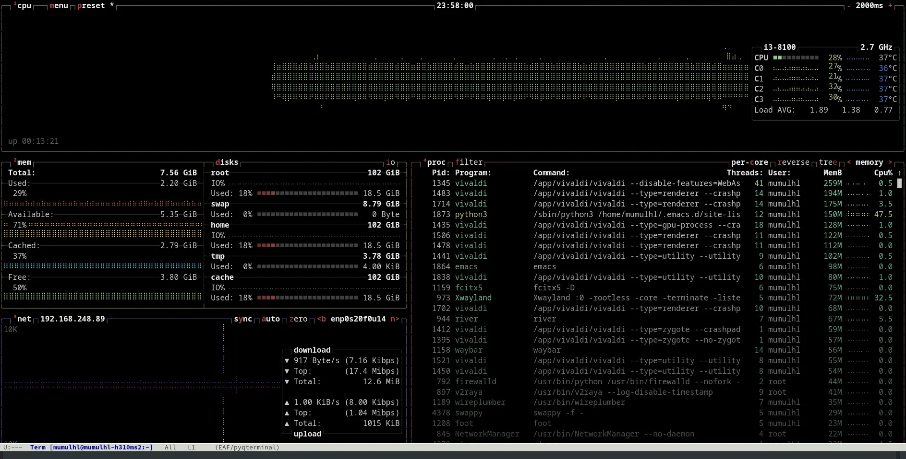

## EAF PyQterminal

A terminal written in PyQt6 for the [Emacs Application Framework](https://github.com/emacs-eaf/emacs-application-framework).



### Load application

[Install EAF](https://github.com/emacs-eaf/emacs-application-framework#install)
first, then add below code in your emacs config:

``` elisp
(add-to-list 'load-path "~/.emacs.d/site-lisp/emacs-application-framework/")
(require 'eaf)
(require 'eaf-pyqterminal)
```

It is recommended to install [Nerd Fonts](https://www.nerdfonts.com) to
support icon display, after install Nerd Fonts, remember set option
`eaf-pyqterminal-font-family`

### Dependency List

  ------------------------- -------------------------------
  Package                   Description
  pyte                      terminal emulator
  psutil                    get child process information
  pywinpty (only Windows)   pty on Windows
  ------------------------- -------------------------------

### The keybinding of EAF PyQterminal.

| Key   | Event   |
| :---- | :------ |
| `C-S-v` | yank_text |
| `C-a` | eaf-send-key-sequence |
| `C-b` | eaf-send-key-sequence |
| `C-c C-c` | eaf-send-second-key-sequence |
| `C-c C-x` | eaf-send-second-key-sequence |
| `C-c C-m` | eaf-send-second-key-sequence |
| `C-d` | eaf-send-key-sequence |
| `C-e` | eaf-send-key-sequence |
| `C-f` | eaf-send-key-sequence |
| `C-g` | eaf-send-key-sequence |
| `C-h` | eaf-send-key-sequence |
| `C-j` | eaf-send-key-sequence |
| `C-k` | eaf-send-key-sequence |
| `C-l` | eaf-send-key-sequence |
| `C-n` | eaf-send-key-sequence |
| `C-o` | eaf-send-key-sequence |
| `C-p` | eaf-send-key-sequence |
| `C-r` | eaf-send-key-sequence |
| `C-s` | eaf-send-key-sequence |
| `C-t` | eaf-send-key-sequence |
| `C-u` | eaf-send-key-sequence |
| `C-v` | scroll_down_page |
| `C-w` | eaf-send-key-sequence |
| `C-y` | yank_text |
| `C-z` | eaf-send-key-sequence |
| `M-f` | eaf-send-key-sequence |
| `M-b` | eaf-send-key-sequence |
| `M-d` | eaf-send-key-sequence |
| `M-c` | toggle_cursor_move_mode |
| `M-k` | scroll_up |
| `M-j` | scroll_down |
| `M-v` | scroll_up_page |
| `M-<` | scroll_to_begin |
| `M->` | scroll_to_bottom |
| `M-w` | copy_text |
| `M-DEL` | eaf-send-alt-backspace-sequence |
| `M-<backspace>` | eaf-send-alt-backspace-sequence |
| `C-M-f` | open_link |
| `<escape>` | eaf-send-escape-key |

### The keybinding of EAF PyQterminal Cursor Move Mode.

Cursor Move Mode allows you to move cursor in the screen.

| Key   | Event   |
| :---- | :------ |
| `j` | next_line |
| `k` | previous_line |
| `l` | next_character |
| `h` | previous_character |
| `e` | next_word |
| `E` | next_symbol |
| `b` | previous_word |
| `B` | previous_symbol |
| `J` | scroll_down |
| `K` | scroll_up |
| `H` | move_beginning_of_line |
| `L` | move_end_of_line |
| `d` | scroll_down_page |
| `u` | scroll_up_page |
| `v` | toggle_mark |
| `y` | copy_text |
| `i` | copy_word |
| `I` | copy_symbol |
| `f` | open_link |
| `q` | toggle_cursor_move_mode |
| `C-a` | move_beginning_of_line |
| `C-e` | move_end_of_line |
| `C-n` | next_line |
| `C-p` | previous_line |
| `C-f` | next_character |
| `C-b` | previous_character |
| `C-v` | scroll_down_page |
| `M-f` | next_word |
| `M-F` | next_symbol |
| `M-b` | previous_word |
| `M-B` | previous_symbol |
| `M-v` | scroll_up_page |
| `M-c` | toggle_cursor_move_mode |
| `M-w` | copy_text |
| `M-d` | copy_word |
| `M-D` | copy_symbol |
| `C-SPC` | toggle_mark |
| `C-M-f` | open_link |

### Thanks for them

EAF PyQterminal uses code of these projects:

-   [PyQterminal](https://github.com/korimas/PyQTerminal)
-   [EAF Terminal](https://github.com/emacs-eaf/eaf-terminal)

There will not be this project if there aren\'t those contributer:

<a href="https://github.com/mumu-lhl/eaf-pyqterminal/graphs/contributors"></a>
